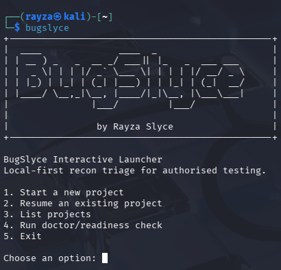
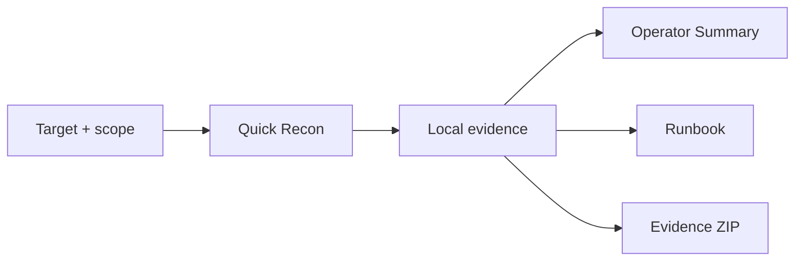

# BugSlyce

[](https://github.com/Rayza-Slyce/bugslyce/actions/workflows/tests.yml)

BugSlyce is a local-first recon triage assistant for authorised labs and
bug bounty-style recon. It runs a bounded, scope-aware evidence collection
workflow, preserves raw artefacts, builds a BugSlyce Recon Pack, and
prioritises evidence-backed leads for manual review.

BugSlyce does not claim confirmed vulnerabilities. Its candidates and
priorities describe where an operator may want to look next, not exploit
severity or proof of impact.

Current version: `0.1.0`

## Why BugSlyce?

BugSlyce is for the messy middle of recon: when you have enough raw output to
lose track, but not enough confirmed signal to write a finding. It keeps the
evidence, groups the leads, and helps you decide what deserves manual
attention first.

It is designed for solo operators, CTF players, and bug bounty learners who
want repeatable first-pass recon without scattering notes, terminal output,
and screenshots across random folders.

## What It Looks Like

Interactive launcher:

<p align="center">
  
</p>

Completed pipeline summary:

```text
BugSlyce project pipeline complete
Final status: completed

Step summary:
* Completed: 11
* No-op: 1
* Failed: 0

Final outputs:
* Report: ~/bugslyce-output/example/report.md
* Runbook: ~/bugslyce-output/example/runbook.md
* Evidence pack: ~/bugslyce-output/example-evidence-pack.zip
```

Operator Summary lead:

```text
Review First

1. Credential-like artefact review in homepage HTML
   Why: Parsed HTML evidence contains a comment referencing credential-like context and related sensitive keyword hits.
   Next: Review the saved HTML/source context manually. Do not submit forms, brute force, or treat any value as valid without explicit authorisation and manual validation.
   Signal: high
```



## Safety Model

BugSlyce is intended only for targets you are authorised to assess.

The live MVP workflow enforces these boundaries:

- A local scope file is required.
- The project target must match a target-like in-scope entry.
- Live project pipelines require explicit `--confirm`.
- The only one-command pipeline profile is `lab-safe-tiny`.
- Live phases use fixed, validated command shapes and bounded timeouts.
- Evidence and generated reports remain local.
- No NSE scripts.
- No UDP scans.
- No brute force.
- No exploitation.
- No recursive discovery.
- No form submission.
- No authentication testing.
- No arbitrary user-supplied command flags, paths, URLs, or wordlists in the
  pipeline.
- No LLM calls in the deterministic MVP pipeline.

Scope matching is a safety control, not a substitute for reading the actual
programme or lab rules. Review the generated `scope.md` before every live run.

## Install

The easiest way to install BugSlyce is with `pipx`, which keeps CLI tools
isolated from your system Python environment.

Install "pipx" if you do not already have it:

```bash
sudo apt install pipx
pipx ensurepath
```

Restart your terminal, then install BugSlyce directly from GitHub:

```bash
pipx install git+https://github.com/Rayza-Slyce/bugslyce.git
bugslyce
```

To check the install:

```bash
bugslyce --version
bugslyce doctor
```

For contributors or local development:

```bash
git clone git@github.com:Rayza-Slyce/bugslyce.git
cd bugslyce
python3 -m venv .venv
source .venv/bin/activate
python -m pip install -U pip
python -m pip install -e ".[dev]"
bugslyce
```

## Quick Start

For a new user in an interactive terminal, start with:

```bash
bugslyce
```

The interactive launcher can run doctor/readiness checks, scaffold a project,
choose **Quick Recon** or **Manual Setup Only**, confirm authorisation, and
optionally run the MVP pipeline. Quick Recon maps to the current
`lab-safe-tiny` pipeline. **Standard Recon** and **Deep Recon** are planned
future modes and are not available yet. Recon mode names do not make activity
automatically safe; authorisation and scope still matter. Manual Setup Only
creates local project files and prints the next safe command preview without
running recon.

Interactive mode defaults to `~/bugslyce-output` so project output is
predictable regardless of the current working directory. Direct CLI commands
still use the paths you provide.

Advanced users and automation can still use direct commands.

Check local readiness:

```bash
bugslyce doctor
```

For direct operation, scaffold a project, review `scope.md`, then run the
approved MVP pipeline only after confirming authorisation and scope:

```bash
bugslyce project scaffold --name example-lab --target 10.10.10.10 --projects-dir bugslyce-output
bugslyce project run --project bugslyce-output/example-lab/bugslyce_project.json --profile lab-safe-tiny --confirm
```

Review the evidence-backed Operator Summary:

```bash
less bugslyce-output/example-lab/report.md
```

Ask BugSlyce what local action is appropriate next:

```bash
bugslyce project next \
  --project bugslyce-output/example-lab/bugslyce_project.json
```

`project next` prints command previews only. It does not execute them.

See [docs/DEMO_WALKTHROUGH.md](docs/DEMO_WALKTHROUGH.md) for a complete
fictional-target MVP walkthrough from readiness checks through review, resume,
and evidence handling.

## Pipeline Workflow

The fixed `lab-safe-tiny` pipeline runs these approved stages in order:

1. Validate the project, scope, and local readiness.
2. Run full TCP discovery with the fixed `lab-tcp-full` profile.
3. Run service/version detection on discovered open TCP ports.
4. Collect bounded HTTP headers, `robots.txt`, and homepage HTML.
5. Follow same-origin paths already present in collected evidence.
6. Create a non-executing `lab-root-tiny` content plan.
7. Execute that exact approved tiny root-discovery plan.
8. Follow selected paths found by content discovery.
9. Fetch bodies only for eligible high-signal HTML/application paths.
10. Generate local recon status.
11. Generate the project runbook.
12. Export a portable evidence pack.

The pipeline stops on a required failure. Content follow-up and body fetch may
complete as clean no-ops when no eligible new work remains.

After a successful run:

```bash
less bugslyce-output/example-lab/report.md
bugslyce project status \
  --project bugslyce-output/example-lab/bugslyce_project.json
bugslyce project next \
  --project bugslyce-output/example-lab/bugslyce_project.json
```

## Resume Workflow

Fresh runs omit `--resume` and refuse an existing recon manifest, tiny plan
directory, or evidence ZIP.

To continue an interrupted or partially completed project:

```bash
bugslyce project run \
  --project bugslyce-output/example-lab/bugslyce_project.json \
  --profile lab-safe-tiny \
  --confirm \
  --resume
```

Resume is conservative:

- It revalidates local readiness, target, and scope.
- It reuses only a coherent prefix of clearly completed phases.
- It validates manifest artefact paths inside the project directory.
- It validates tiny-plan target, profile, scope, input, and output provenance.
- It refuses mixed-target, missing-artefact, path-escape, or otherwise
  ambiguous state.
- It regenerates status and runbook output.
- It does not overwrite an existing evidence ZIP.
- It skips an existing ZIP only when completed pipeline metadata verifies the
  prior export.

`project_pipeline.md` and `project_pipeline.json` record completed,
`skipped_existing`, no-op, failed, and pending stages.

## Outputs

A completed project may contain:

- `report.md`: the human-readable BugSlyce Recon Pack and Operator Summary.
- `project_state.json`: structured parsed assets, services, paths, evidence,
  and candidates.
- `recon_manifest.json`: target and raw artefact provenance.
- `recon_status.md` and `recon_status.json`: detected phases, coverage, latest
  execution, and deterministic next-step advice.
- `runbook.md`: project paths, scope reminders, current status, and safe
  command previews.
- `project_pipeline.md` and `project_pipeline.json`: pipeline timing, step
  status, reused evidence, failures, and final output paths.
- `recon_execution.md` and `recon_execution.json`: latest live phase metadata.
- Phase-specific execution metadata where applicable.
- Raw nmap, curl, HTML, robots, and gobuster artefacts referenced by the
  manifest.
- `bugslyce-output/example-lab-evidence-pack.zip`: portable evidence archive.

The evidence pack contains an export manifest and safety README. It may
contain target IPs, URLs, response headers, HTML, service banners, and
discovered paths. Review it before sharing.

ZIP entry timestamps remain fixed for reproducible packaging. Real UTC export
time is stored inside the archive metadata.

## Operator Summary

`report.md` starts with a deterministic Operator Summary:

- **Review First** ranks the most useful evidence-backed leads.
- **Low-Signal / Avoid Rabbit Holes** identifies dead paths, static assets,
  default-page noise, and other context that should not be over-weighted.
- **Current Coverage** records what the recon pack has and has not observed.
- Evidence IDs link summary statements to the detailed raw and structured
  evidence below.

Encoded-looking artefacts are classified conservatively as `likely_signal`,
`possible_signal`, or `likely_noise`. BugSlyce does not decode them
automatically or claim what they mean.

Manual review candidates are leads, not confirmed vulnerabilities. Priority
means manual attention priority, not exploit severity. Manual validation is
required before reporting any issue.

## Command Surface

Most operators should start with the interactive launcher:

```bash
bugslyce
```

Useful direct commands:

```bash
bugslyce doctor
bugslyce project next --project bugslyce-output/example-lab/bugslyce_project.json
bugslyce project run --project bugslyce-output/example-lab/bugslyce_project.json --profile lab-safe-tiny --confirm --resume
bugslyce recon export --input-dir bugslyce-output/example-lab --output bugslyce-output/example-lab-evidence-pack.zip
```

For the full command surface:

```bash
bugslyce project --help
bugslyce recon --help
```

Lower-level recon commands remain available for debugging, reviewed manual
operation, and phase-specific recovery. Live lower-level commands retain their
own confirmation, scope, structured argument, timeout, output-path, and
provenance checks. Use each command's `--help` before manual operation.

Project metadata is local JSON. It should not contain credentials, API keys,
tokens, or other secrets.

### Content Discovery Profiles

- `lab-root-tiny` uses the bundled small generic wordlist. It is the approved
  proving profile used by `lab-safe-tiny`.
- `lab-root-light` uses the expected local dirbuster small wordlist and is a
  broader optional root-only profile.

`lab-root-light` is not yet part of the one-command MVP pipeline. 

### Evidence Pack Export

```bash
bugslyce recon export \
  --input-dir bugslyce-output/example-lab \
  --output bugslyce-output/example-lab-evidence-pack.zip
```

Export reads local files only. It does not run recon or make network requests.
It includes allowlisted reports, status, execution metadata, scope, and
manifest-referenced raw artefacts. Paths outside the input directory and
traversal references are rejected.

## Existing Evidence Import

The original deterministic import command remains available:

```bash
bugslyce run INPUT_DIR --output OUTPUT_DIR
```

BugSlyce can parse selected saved nmap normal output, gobuster output, curl
headers, robots files, HTML, `httpx.jsonl`, URL lists, subdomain lists, and
`recon_manifest.json`. This mode performs local parsing and report generation;
it does not run live recon.

When present, `recon_manifest.json` provides the primary target and artefact
context. Raw evidence remains available for auditability even when repeated
discovery profiles observe the same path. Human-facing status and provenance
summaries distinguish raw discovered-path rows from unique URL strings.

## Current MVP Limitations

- `lab-safe-tiny` is intentionally conservative and is not thorough recon.
- `lab-root-light` is optional and manually planned; it is not part of the
  default project pipeline.
- Resume may refuse evidence when completion or provenance is ambiguous.
- There is no deep crawler or recursive discovery.
- There is no authenticated testing.
- There is no vulnerability confirmation or exploitation workflow.
- There is no brute force, form submission, NSE, or UDP pipeline phase.
- There is no LLM analysis in the default deterministic workflow.
- There is no cloud sync or evidence upload.
- Scope matching uses simple target-like exact host and supported suffix or
  wildcard forms. It does not replace human programme-scope review.
- Status and candidate ranking are deterministic heuristics, not proof that a
  target is safe or vulnerable.
- BugSlyce assists evidence collection and triage; it does not replace manual
  validation or responsible disclosure judgement.

## Local Data Safety

Real targets and evidence should remain in gitignored locations such as
`private_recon/` and `bugslyce-output/`.

Do not commit:

- Real target identifiers or private programme scope.
- Raw recon output, screenshots, Burp files, or HAR files.
- Export ZIPs.
- API keys, credentials, cookies, tokens, or `.env` secrets.

Absence of evidence is not proof of safety.

## Security Policy

Please report sensitive vulnerabilities in BugSlyce privately. Do not open
public issues containing third-party target evidence, credentials, cookies,
tokens, API keys, or private programme data.

See [SECURITY.md](SECURITY.md) for details.

## Development Sanity Checks

These checks do not start live recon:

```bash
.venv/bin/pytest
.venv/bin/bugslyce doctor
.venv/bin/bugslyce wizard
.venv/bin/bugslyce project run --help
.venv/bin/bugslyce recon --help
```

The test suite mocks live process execution and must not contact targets.

## MVP Release Checkpoint

- Current version: `0.1.0`
- Main MVP pipeline: `lab-safe-tiny`
- Release tag: `v0.1.0`
- Package publishing: not performed


See [docs/RELEASE_CHECKLIST.md](docs/RELEASE_CHECKLIST.md) before tagging
future releases.

## Licence

BugSlyce is released under the MIT Licence. See `LICENSE` for the full text.
